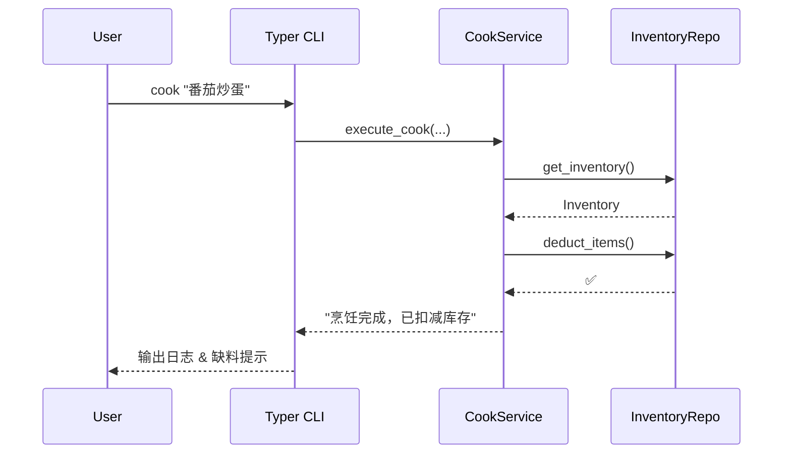

# Cookmate 🍳

*个人菜谱 & 冰箱库存管理器 — 录菜、管料、选菜、买菜，一条龙完成*


> **写 README 在写代码之前。**  
> “README 是项目的北极星，为开发与用户指明方向。” – *改写自 Tom Preston‑Werner*

---

## 📚 目录

* [✨ 核心功能 (MVP)](#-核心功能-mvp)
* [🛠 快速开始](#-快速开始)
* [🏗 项目结构](#-项目结构)
* [🔌 技术选型 & 架构](#-技术选型--架构)
* [🗺 路线图](#-路线图)
* [🤝 贡献指南](#-贡献指南)
* [📄 License](#-license)

---

## ✨ 核心功能 (MVP)

> 以下 **五大功能** 为 *首个可上线版本* 的必交付范围。

| 领域       | 说明                                 |
| -------- | ---------------------------------- |
| **菜谱管理** | **新增 / 编辑** 菜谱（支持 Markdown、CSV 导入） |
| **库存管理** | 追踪 **食材数量 & 保质期**（扫码 / 手动录入）       |
| **烹饪执行** | 烹饪前 **校验库存 → 扣减 → 写入烹饪日志**         |
| **智能筛选** | 依据 **难度 / 时长 / 现有食材** 多维过滤可做菜      |
| **购物清单** | **自动汇总缺料**，一键生成门店分拆买菜清单            |

> ☝️ 完成以上闭环即可发布 *v0.1.0* CLI + SQLite 版本。

---

## 🛠 快速开始

```bash
# 1. 克隆仓库
$ git clone https://github.com/yourname/cookmate.git && cd cookmate

# 2. 建立虚拟环境
$ python3 -m venv .venv && source .venv/bin/activate

# 3. 安装运行依赖
$ pip install -e .

# （可选）安装开发工具链
$ pip install -e .[dev]

# 4. 运行单元测试
$ PYTHONPATH=$PWD pytest -q
```

### 运行 API & 前端

```bash
$ ./scripts/dev.sh
```

脚本会自动切换到仓库根目录并分别在 `8000`（API）与 `8001`（前端）端口启动服务，
按 `Ctrl+C` 退出。

### CLI 体验

```bash
# 添加菜谱
$ cookmate add-recipe "番茄炒蛋.md"

# 烹饪（自动扣库存）
$ cookmate cook "番茄炒蛋"

# 查看当前库存
$ cookmate inventory list
```

> 💡 CLI 基于 **Typer**，在任何步骤追加 `--help` 获得详细用法。

---

## 🏗 项目结构

```text
.
├── adapters/              # 各类技术实现 (Adapters)
│   ├── repo_memory/       # 纯内存仓库（测试 / 原型）
│   └── repo_sqlite/       # SQLite 仓库（生产首选）
├── app/                   # 用例层 (Application)
├── domain/                # 领域模型 (Domain)
│   ├── recipe/            # 聚合根 Recipe
│   ├── ingredient/        # 聚合根 Ingredient
│   ├── inventory/         # 聚合根 InventoryItem
│   └── shared/            # 值对象 & 领域事件
├── infra/                 # 数据库 / 消息总线等基础设施
├── tests/                 # pytest 测试
└── pyproject.toml         # 构建 & 依赖声明
```

---

## 🔌 技术选型 & 架构

| 层次              | 方案                                     | 说明           |
| --------------- | -------------------------------------- | ------------ |
| **Domain**      | 纯 Python / `dataclass` / `pydantic v2` | 业务逻辑零依赖，易于测试 |
| **Application** | 服务 + 命令 + DI                           | 控制事务与跨聚合操作   |
| **Adapters**    | `Typer` CLI、`SQLAlchemy 2.0`、FastAPI   | 与外界交互，实现依赖倒置 |
| **Infra**       | SQLite → PostgreSQL                    | 持久化与事件驱动扩展   |

> 架构遵循 **Hexagonal Architecture**，核心域层与框架完全解耦，可平滑迁移到微服务或云函数。

### 流程示例



---

## 🗺 路线图

| 版本 | 里程碑 | 状态 |
| -------- | ------------------------ | ------ |
| **v0.1** | MVP 五大功能 (CLI + SQLite) | ✅ 完成 |
| **v0.2** | FastAPI + 前端 Demo | ✅ 完成 |
| **v0.3** | 优化前端 UI 和 PlannerService（智能筛选 & 购物清单优化） | ✅ 完成 |
| **v0.4** | 优化前端 UI 动画 | ⏳ 规划 |
| **v0.5** | 完善全部功能 | ⏳ 规划 |
| **v0.6** | Docker 部署 | ⏳ 规划 |
| **v1.0** | 多用户 / 权限、条形码识别、语音录入 | ⏳ 规划 |

---

## 🤝 贡献指南

1. 先在 **Issue** 中讨论需求 / 缺陷，达成共识。
2. Fork → 新建分支 `feat/xxx` / `fix/xxx`。
3. 保证 `pytest`, `ruff`, `mypy --strict` 全绿。
4. 提交 PR 并引用对应 Issue，遵循 **Conventional Commits**。

> **Commit Message 模板**
>
> ```text
> feat(recipe): 支持批量导入 CSV 菜谱
> ```

---

## 📄 License

[MIT](LICENSE) © 2025 Your Name

---

> 📝 *Cookmate* 仍处于 **Pre‑alpha** 阶段，欢迎 Star / Watch 获得最新进展。
